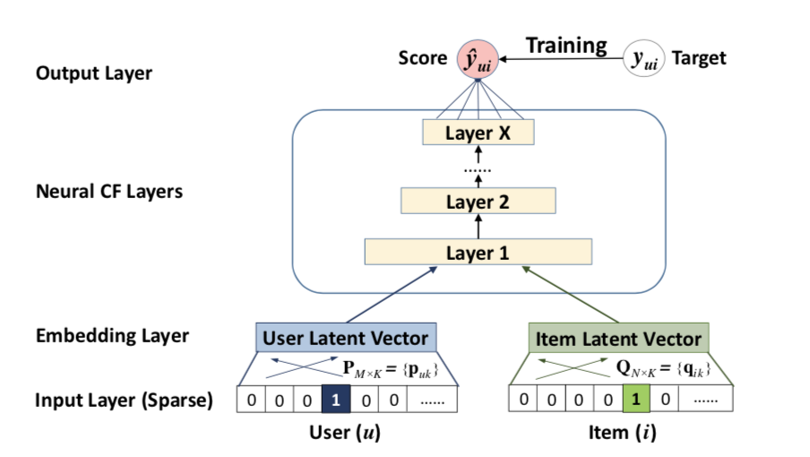
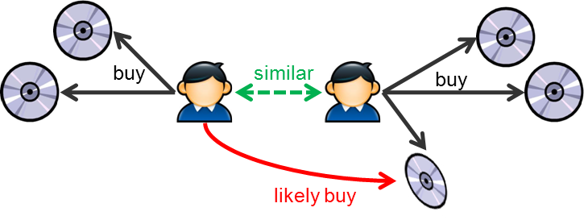
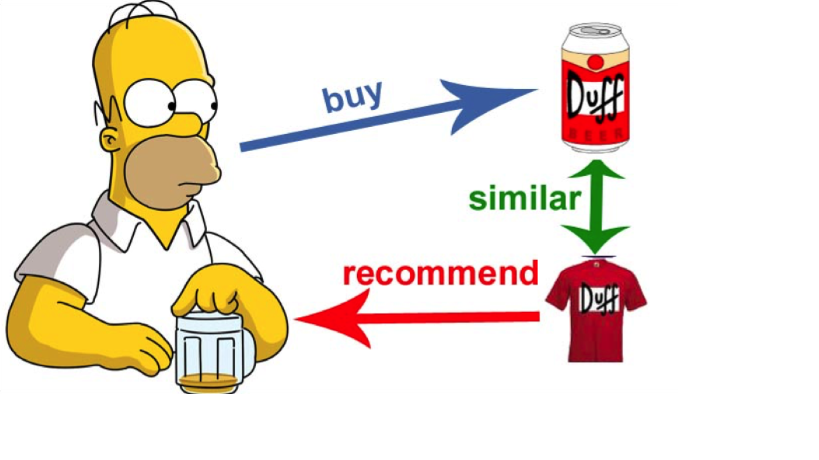
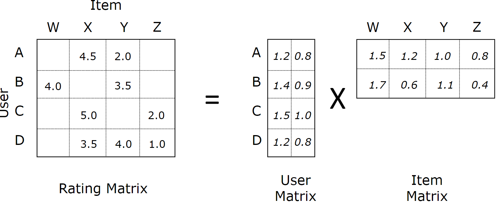
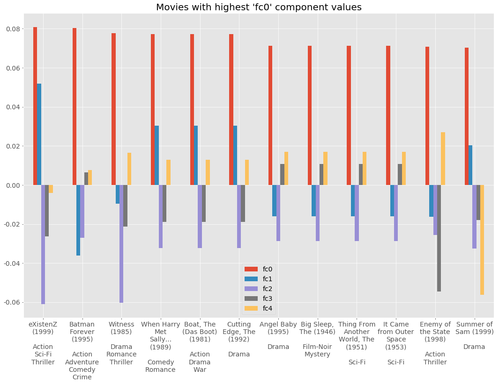
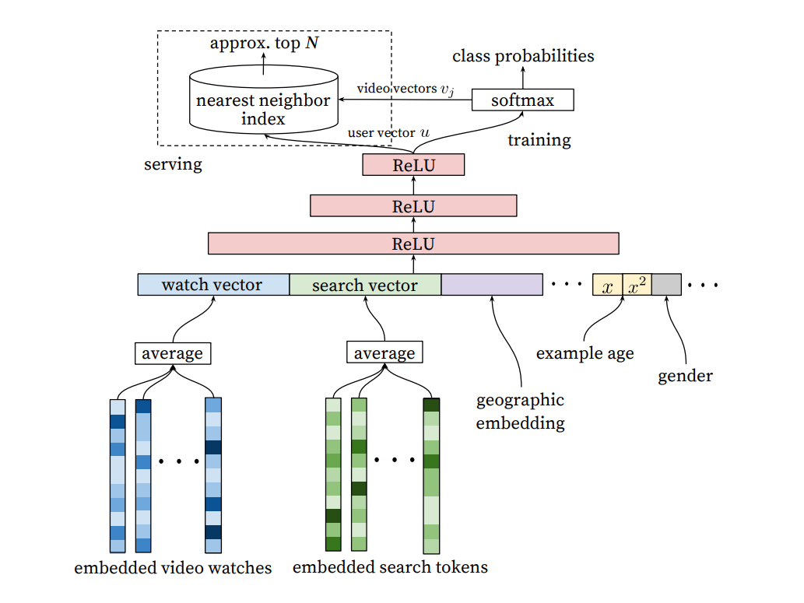

### spacy

`kubectl -n zhuker create -f spacyapi.yml`

sentence to vector https://github.com/hanxiao/bert-as-service

### Evaluating recommender systems

http://fastml.com/evaluating-recommender-systems/

### recommender systems 

https://towardsdatascience.com/recommender-systems-using-deep-learning-in-pytorch-from-scratch-f661b8f391d7

HR = 0.6013 | NDCG = 0.3294

https://towardsdatascience.com/creating-a-hybrid-content-collaborative-movie-recommender-using-deep-learning-cc8b431618af

https://medium.com/recombee-blog/machine-learning-for-recommender-systems-part-1-algorithms-evaluation-and-cold-start-6f696683d0ed

https://towardsdatascience.com/intro-to-recommender-system-collaborative-filtering-64a238194a26

https://towardsdatascience.com/paper-summary-matrix-factorization-techniques-for-recommender-systems-82d1a7ace74

Matrix factorization. Let there be matrix A with dimensionality of (m,n) this matrix can be viewed as a dot product between two matrix with each matrices having dimensions of (m,k) and (k,n).

https://blog.fastforwardlabs.com/2018/04/10/pytorch-for-recommenders-101.html

### matrix factorization in pytorch

https://www.ethanrosenthal.com/2017/06/20/matrix-factorization-in-pytorch/

https://github.com/EthanRosenthal/torchmf

### recommender framework
https://github.com/maciejkula/spotlight

https://medium.com/snipfeed/how-variational-autoencoders-make-classical-recommender-systems-obsolete-4df8bae51546
https://medium.com/snipfeed/time-dependent-recommender-systems-part-2-92e8dfaf1199

https://medium.com/@iliazaitsev/how-to-implement-a-recommendation-system-with-deep-learning-and-pytorch-2d40476590f9

### Youtube

https://towardsdatascience.com/recommender-systems-in-practice-cef9033bb23a

https://towardsdatascience.com/using-deep-neural-networks-to-make-youtube-recommendations-dfc0a1a13d1e

https://static.googleusercontent.com/media/research.google.com/en//pubs/archive/45530.pdf

The Youtube recommender system (Youtube|2016) built deep learning models to predict users' watch given their previous activities (search queries and videos watched) and static information (gender, location, etc.). Watched videos and queries are represented as embeddings. Since neural networks typically take fixed-length inputs, a user’s watched videos or queries vectors are averaged, concatenated with other static features. It is recommended that features with multiple categories should be embedded into a much smaller space (roughly proportional to the logarithm of the number of unique values), and continuous features should be normalized between 0 and 1 (Youtube|2016).

### ideas

- startup
    - id embedding (torch.nn.Embedding layer)
    - industry embeddings like word2vec 
    - average of industry embeddings
    - geography (torch.nn.Embedding layer)
    - TODO: startup description paragraph or website text vector 
    - TODO: founded date present in 7375 out of 45955 startups
    - TODO: e.g. founded date is present in https://www.crunchbase.com/organization/medl-mobile but absent in db
    - age of startup at time of investment
    - time since invested x=normalized(t), sqrt(x), x**2
- fund
    - id embedding (torch.nn.Embedding layer)
    - geography emb (shared with startup geo emb)
    - age of fund at time of investment
    - TODO: tweets of founders?
    - _travel_ time between fund and startup locations (4206 uniq cities, 14035 distinct routes between startup and investor)
